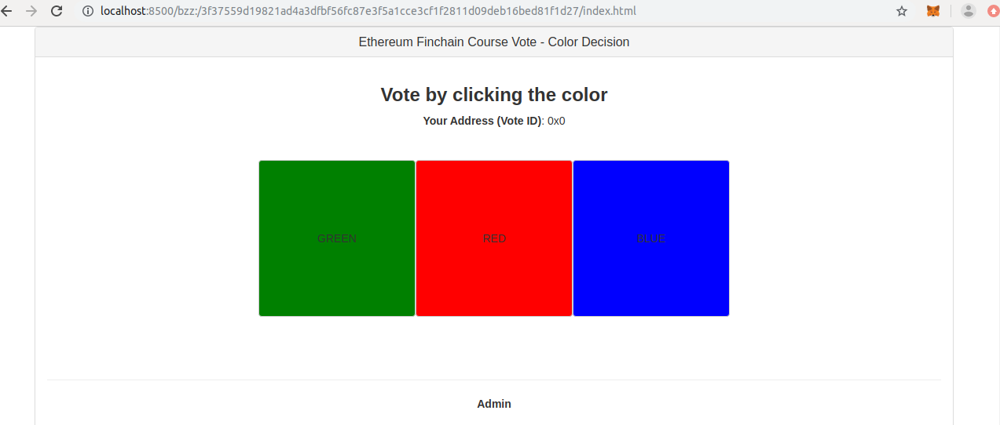

# Aula 05

## EthereumFinchainCourseVote

```bash
git clone https://github.com/glauberdm/EthereumFinchainCourseVote.git

Cloning into 'EthereumFinchainCourseVote'...
remote: Enumerating objects: 101, done.
remote: Counting objects: 100% (101/101), done.
remote: Compressing objects: 100% (60/60), done.
remote: Total 101 (delta 42), reused 96 (delta 37), pack-reused 0
Receiving objects: 100% (101/101), 475.16 KiB | 0 bytes/s, done.
Resolving deltas: 100% (42/42), done.
Checking connectivity... done.

# install web3
npm i web3
...
+ web3@1.2.4
added 849 packages from 555 contributors in 90.726s


   ╭────────────────────────────────────────────────────────────────╮
   │                                                                │
   │       New minor version of npm available! 6.9.0 → 6.13.2       │
   │   Changelog: https://github.com/npm/cli/releases/tag/v6.13.2   │
   │               Run npm install -g npm to update!                │
   │                                                                │
   ╰────────────────────────────────────────────────────────────────╯


# install 
npm i ethereum-ens

> keccak@2.1.0 install /home/ethereum-fiap/EthereumFinchainCourseVote/node_modules/ethereumjs-abi/node_modules/keccak
> npm run rebuild || echo "Keccak bindings compilation fail. Pure JS implementation will be used."


> keccak@2.1.0 rebuild /home/ethereum-fiap/EthereumFinchainCourseVote/node_modules/ethereumjs-abi/node_modules/keccak
> node-gyp rebuild

make: Entering directory '/home/ethereum-fiap/EthereumFinchainCourseVote/node_modules/ethereumjs-abi/node_modules/keccak/build'
  CXX(target) Release/obj.target/keccak/src/addon.o
  CC(target) Release/obj.target/keccak/src/libkeccak-64/KeccakSpongeWidth1600.o
  CC(target) Release/obj.target/keccak/src/libkeccak-64/KeccakP-1600-opt64.o
  SOLINK_MODULE(target) Release/obj.target/keccak.node
  COPY Release/keccak.node
make: Leaving directory '/home/ethereum-fiap/EthereumFinchainCourseVote/node_modules/ethereumjs-abi/node_modules/keccak/build'
npm WARN ethereum-finchain-course-vote@ No repository field.
npm WARN ethereum-finchain-course-vote@ No license field.
npm WARN optional SKIPPING OPTIONAL DEPENDENCY: fsevents@1.2.9 (node_modules/fsevents):
npm WARN notsup SKIPPING OPTIONAL DEPENDENCY: Unsupported platform for fsevents@1.2.9: wanted {"os":"darwin","arch":"any"} (current: {"os":"linux","arch":"x64"})

+ ethereum-ens@0.7.8
added 3 packages from 8 contributors and moved 4 packages in 14.005s

# executando node
node src/js/ens.js 
cowsay.eth 0xCd1f55318De39Bd2e8D32A7A949CA4Bb7c865c88
```

Após algumas alteraçes no `ens.js` (pdf da aula) rode:

```bash
node src/js/ens.js 

cowsay.eth 0xCd1f55318De39Bd2e8D32A7A949CA4Bb7c865c88
Endereço cowsay.eth

```


## swarm 

## Censorship resistant storage and communication infrastructure for a sovereign digital society.

* https://swarm-gateways.net/

Agora, faça download do Swarm 64 bits:

* https://ethswarm.blob.core.windows.net/builds/swarm-linux-amd64-0.5.4-7758fb23.tar.gz

```bash
# volte para o seu home
cd ~

# download do swarm-linux 64bits
wget -c https://ethswarm.blob.core.windows.net/builds/swarm-linux-amd64-0.5.4-7758fb23.tar.gz

# descompactar o swarm
tar -zxvf swarm-linux-amd64-0.5.4-7758fb23.tar.gz

# entrar dentro do diretorio do swarm
cd swarm-linux-amd64-0.5.4-

# listar os diretorios
ls -l
-rw-rw-r-- 1 ethereum-fiap ethereum-fiap    32397 Nov 29 10:22 COPYING
-rwxrwxr-x 1 ethereum-fiap ethereum-fiap 58989239 Nov 29 10:24 swarm

# move o executavel para /usr/local/bin
sudo cp swarm /usr/local/bin

# agora, execute o comando swarm
swarm 
INFO [12-07|14:32:50.926] Maximum peer count                       ETH=50 LES=0 total=50
INFO [12-07|14:32:50.926] You don't have an account yet. Creating one... 
Your new account is locked with a password. Please give a password. Do not forget this password.
Passphrase: 
Repeat passphrase: 
Unlocking swarm account 0x1B8a338d70f51b9F095A7bAb6b423A4082975f84 [1/3]
Passphrase: 
INFO [12-07|14:34:31.263] Starting peer-to-peer node               instance=swarm/v0.5.4-7758fb23/linux-amd64/go1.13.4
INFO [12-07|14:34:31.331] New local node record                    seq=1 id=4eacfd229d21656e ip=127.0.0.1 udp=30399 tcp=30399
INFO [12-07|14:34:31.331] Updated bzz local addr                   oaddr=87b4e920c4b9d1f635e3e479a9af78c53cff62ab5e6e069b42ec73f56dac54b5 uaddr=enode://06a9af15ce169358717040d9f60d07bf2e6484ae6e59704df5ed21e808653aa5802454baa49930339ef2768e97aa013bbdc3f0912fba2c9c8f99159cefd9cc59@127.0.0.1:30399
INFO [12-07|14:34:31.331] Starting bzz service 
INFO [12-07|14:34:31.331] Starting hive                            baseaddr=87b4e920
INFO [12-07|14:34:31.331] Detected an existing store. trying to load peers 
INFO [12-07|14:34:31.331] hive 87b4e920: no persisted peers found 
INFO [12-07|14:34:31.331] Swarm network started                    bzzaddr=87b4e920c4b9d1f635e3e479a9af78c53cff62ab5e6e069b42ec73f56dac54b5
INFO [12-07|14:34:31.331] bzzeth starting... 
INFO [12-07|14:34:31.331] Starting outbox 
INFO [12-07|14:34:31.331] Started Pss 
INFO [12-07|14:34:31.331] Loaded EC keys                           pubkey=04a91c456554f2bc921ac9aaef84c557d839f46ad03509d44969391cd20549bf47ea163ef8e876615d459a812b38fba2983eb383b29f0796207cd46c26de80e429 secp256=03a91c456554f2bc921ac9aaef84c557d839f46ad03509d44969391cd20549bf47
INFO [12-07|14:34:31.332] starting bzz-retrieve                    base=87b4e920c4b9d1f6
INFO [12-07|14:34:31.332] IPC endpoint opened                      url=/home/ethereum-fiap/.ethereum/bzzd.ipc
INFO [12-07|14:34:31.333] Started P2P networking                   self=enode://06a9af15ce169358717040d9f60d07bf2e6484ae6e59704df5ed21e808653aa5802454baa49930339ef2768e97aa013bbdc3f0912fba2c9c8f99159cefd9cc59@127.0.0.1:30399
INFO [12-07|14:34:31.333] Starting Swarm HTTP proxy                port=8500
WARN [12-07|14:36:39.414] Served eth_coinbase                      reqid=3 t=8.836µs err="the method eth_coinbase does not exist/is not available"
WARN [12-07|14:36:39.415] Served eth_blockNumber                   reqid=4 t=6.371µs err="the method eth_blockNumber does not exist/is not available"

```

**Abra uma nova aba de terminal...**

```bash
geth attach /home/ethereum-fiap/.ethereum/bzzd.ipc
INFO [12-07|14:36:39.227] Bumping default cache on mainnet         provided=1024 updated=4096
WARN [12-07|14:36:39.228] Sanitizing cache to Go's GC limits       provided=4096 updated=2659
Welcome to the Geth JavaScript console!

 modules: accounting:1.0 admin:1.0 bzz:1.0 debug:1.0 hive:1.0 pss:1.0 rpc:1.0 swarmfs:1.0 web3:1.0

> 
```

```bash
 _________________________________________
/ Agora chame o cara da fiap para liberar \
\ sei lá o que!                           /
 -----------------------------------------
        \   ^__^
         \  (oo)\_______
            (__)\       )\/\
                ||----w |
                ||     ||

```

Abra outro terminal e digite:

```bash
# voltar para home
cd

# entrar no projeto Vote
cd EthereumFinchainCourseVote/

# entar no dir src
cd src/

# listar
ls
ColorDecision.json  css  fonts  index.html  js

# tar
tar cf vote.tar .
tar: ./vote.tar: file is the archive; not dumped

# listar
ls
ColorDecision.json  css  fonts  index.html  js  vote.tar

# rode o curl
curl -X POST -H "Content-Type: application/x-tar" --data-binary @vote.tar http://localhost:8500/bzz:/

3f37559d19821ad4a3dfbf56fc87e3f5a1cce3cf1f2811d09deb16bed81f1d27
```

Agora, copie e cole no browser:

```bash
http://localhost:8500/bzz:/3f37559d19821ad4a3dfbf56fc87e3f5a1cce3cf1f2811d09deb16bed81f1d27/index.html
```




Subindo agora por outro caminho:

```bash
# criando um arquivo meta data (.md)
echo "FIAP MBA Blockchain" > fiap.md

# swarm up
swarm up --progress fiap.md
Swarm Hash: 0aa7e0debdbb02e5f6f276e43a72aae5989ef2178d14668d403cde113894cec5
Tag UID: 3342789442
Upload status:
Syncing 1 chunks       0s [--------------------------------------------------------------] 0 %
Done! took 7.855914149s
Your Swarm hash should now be retrievable from other nodes!
```

**Agora, copie e cole no browser:**

```bash
http://localhost:8500/bzz:/0aa7e0debdbb02e5f6f276e43a72aae5989ef2178d14668d403cde113894cec5/
```

Bora subir para a rede mundial de computadores:

```bash
swarm --bzzapi https://swarm-gateways.net up fiap.md
0f47a35cb82bdba095b64cee23616e6aca9c3e57b15e99580bbd2741406cb5f0
```

**Agora, copie e cole no browser:**

```bash
https://swarm-gateways.net/bzz:/0f47a35cb82bdba095b64cee23616e6aca9c3e57b15e99580bbd2741406cb5f0/
```

```bash
swarm --bzzapi https://swarm-gateways.net/ --recursive up .
f1db354cbd55724dd0f5a380c2800922bc5b680341cb142e62ad9d58e67c64f7

cd ..

swarm --bzzapi https://swarm-gateways.net/ --defaultpath src/index.html --recursive up src
31c4f56863c6024d7131c9055ffe1e788a60724adc9c7466867f7609ced6796f

```


